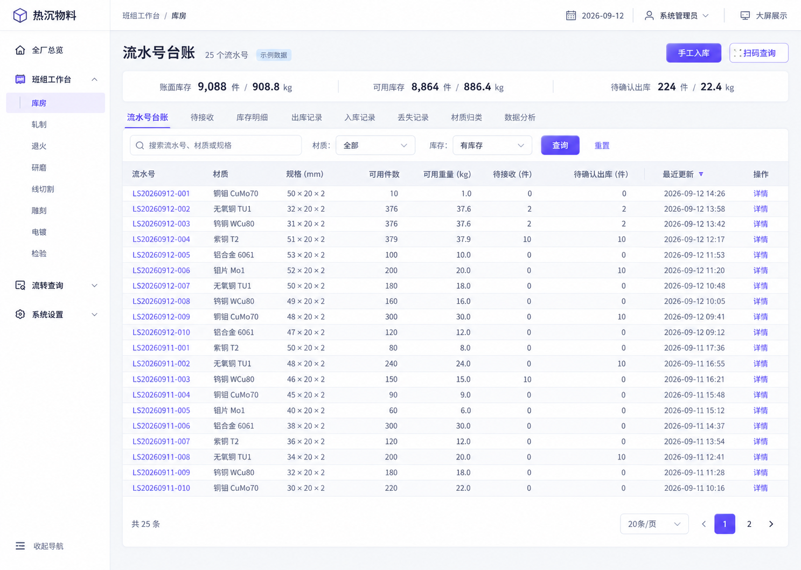
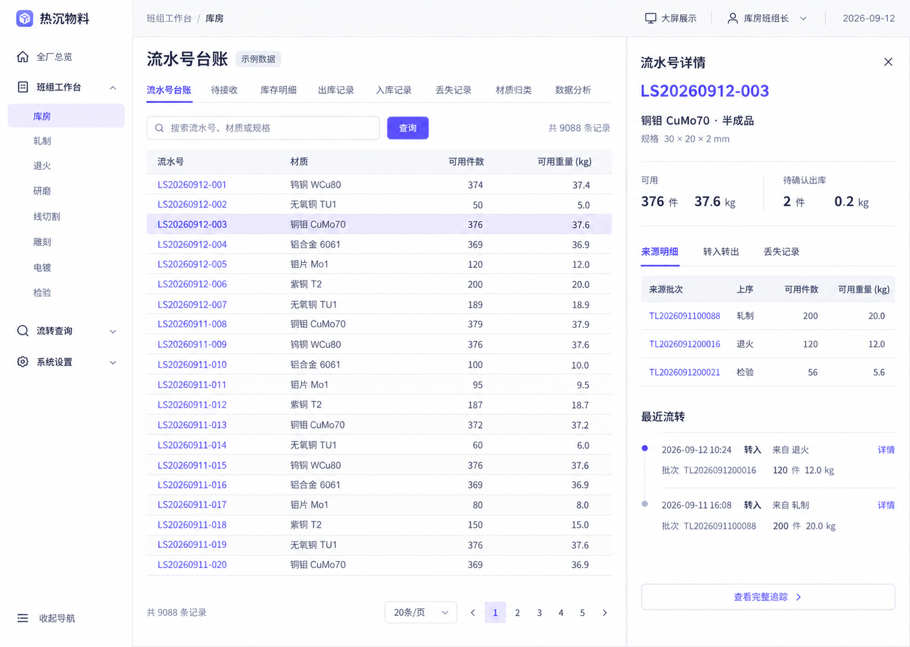
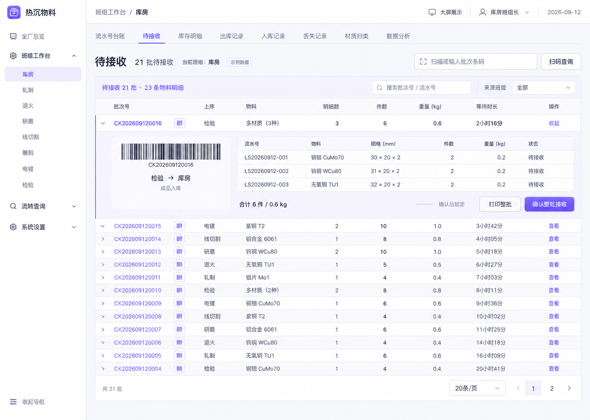

# 全页面界面审查 · 2026-09-12

状态：仅审查，未修改应用代码、未提交业务数据。

## 范围与方法

本地 Vue 3 应用，独立 Chrome，同一浏览器会话逐页检查。主要视口 1440×900；补查动态大屏 2560×1440 全屏、流水号台账和导航 390×844。管理员、库房班组长两种真实本地账号。8 个班组入口均打开；库房覆盖全部 8 个工作区页签，其他 7 个班组覆盖默认页面，复用视图不重复穷举每个组合。保存的截图均为本轮现场采集，已逐张查看。

没有使用 Codex 内置浏览器。审查没有提交入库、出库、接收、丢失或账号修改，没有部署。

## 总体结论

已有统一组件库和一部分设计变量，但还没有统一的页面组织规则。主要问题不是缺组件，而是「批次和明细层级混杂、重复入口、过大的详情卡片、每页各自的样式覆盖」。不需要换掉 Vue 3 / Element Plus / ECharts，也不需要把全部页面推翻重做。

应保留：8 个班组各自页面；流水号台账、材质归类、图表分析分开；普通列表默认 20 条并可选 50/100；整批条码和打印；原统计总览与独立动态大屏。

## 优先级与修改建议（尚未实施）

| 优先级 | 问题与证据 | 建议 |
|---|---|---|
| P1 | 转料记录按 TL 明细，待接收重复 CK 整批，出库按 CK；条/批数不一致（4、11、14） | 接收/出库以 CK 整批为单位，一批一行；展开看 TL 明细，明确「批次数 / 明细条数 / 流水号数」。保留全部历史数据。 |
| P1 | 窄整批详情仅 3 条明细也无法一屏核对（6、21） | 上部：批次号、条码、上下序、状态；中部：紧凑明细表；底部：合计和确认。保留确认后锁定规则。 |
| P1 | 全局手填转料与班组库存出库两个入口并存（20、22） | 普通流转集中在班组库存发起；如需手工补录，单独明确用途。不要在视觉调整中擅自改变数据规则。 |
| P1 | 固定 8 班组，管理页仍突出新增且允许改内部 code（17） | 先对齐固定班组模型：展示班组和负责人；保护内部标识；不让新增按钮暗示自动生成一个不存在的工作台。 |
| P2 | 侧栏全部分组展开；工作台页签多且图标等权（2、8、16） | 只默认展开当前分组。一级按任务分类，二级为页面/班组；保留8组。当前班组和当前页明确。常用操作优先，图表分析放后。 |
| P2 | 3 种详情布局、3 种状态外观、输入/选择器尺寸不齐（5、6、9、13、18—22） | 统一页面标题、工具栏、表格、状态、弹窗/抽屉规范；不靠每页追加 CSS。 |
| P2 | 同一「半成品」库房图为绿，轧制图为紫（8、16） | 固定物料类型和状态的颜色映射；文字标签始终保留，不单靠颜色。 |
| P2 | 追踪 18 个事件首屏仅两项（7） | 首先显示同流水号当前各班组余额；事件记录改紧凑表，时间线作为详情呈现。不把最近一批的去向当整条流水号全部位置。 |
| P2 | 每行条码占约 400px，状态反而很小（14） | 保留条码，提供紧凑条码列/显示切换/展开预览；打印保留完整清晰条码。实际可扫性需单独验证。 |
| P3 | 图表等大、轮播控制与日常查询抢位置（2、8） | 管理首页突出待办与主要指标，统计图可按主题切换；轮播控制主要在大屏模式显示。 |

## 导航建议

一级建议为「全厂总览」「班组工作台」「流转查询」「系统设置」。班组工作台下保留「库房、轧制、退火、研磨、线切割、雕刻、电镀、检验」八个二级页面。流转查询下保留「转料记录」「流水号追踪」；扫码仍可从工作区按钮进入，原独立页面不必删除。动态大屏保留独立入口，可放在顶栏「大屏展示」。系统设置默认收起。

页面内继续把数据分析、流水号台账、材质归类分开，但按操作频次排序并去掉每项都配图标的噪声。建议班组默认落到流水号台账/库存任务，不再先落到六张统计图。管理员查看与班组长录入的权限区别要保留。

## 文案对照

| 现在可见的文字 | 建议文字/处理 | 原因 |
|---|---|---|
| 扫码接收 / 扫码查单 / 扫码查看来料 | 扫码查询；接收动作单独叫「确认接收」 | 导航与页面名称一致，兼容管理员只读。 |
| 扫描 CK 整批条码或输入历史 TL 号 | 扫描或输入批次条码；历史单号说明放辅助提示 | 用户不必先学技术前缀。 |
| 流水追踪 | 流水号追踪 | 明确查询对象。 |
| 已接收物料 | 库存明细 | 当前页默认有可用余额，不只是历史记录。 |
| 当前可用 / 有可用余量 | 可用库存 / 仅显示有库存 | 统一库存语义。 |
| 待转出确认 / 出库占用 | 待确认出库（占用库存） | 简短但保留真实扣占含义。 |
| 分析筛选 | 按实际选项命名，如「库存状态」；其他分析条件放更多筛选 | 不让用户猜下拉作用。 |
| 更多分析 | 展开图表 / 对应分析名称 | 行为明确。 |
| 只读查看 / 管理员只读 | 仅查看 | 角色原因可由账户与提示表达。 |
| 普通班组 / 系统项 | 班组 / 固定班组 | 减少开发内部措辞。 |
| 保存班组长 | 创建账号 / 保存修改 | 按新增、编辑分别表达。 |
| 例如 zhabanzhang | 例如 roll_leader | 去除旧「扎板」称呼残留。 |
| 丢失记录 | 保留 | 不应改成泛化的损耗/报废，避免和库房转废混淆。 |

测试记录中「测试数据：…」「演示班组长」属于数据内容，不是正式产品文案；本轮不擅自清理。

## 统一视觉规范建议

- 浅灰页面底色、白色主工作区、单一靛紫主色；成功绿、待确认琥珀色、错误红固定语义。保留深色大屏作为独立展示模式。
- 一页一个主标题、一个主操作；概况用一条紧凑汇总，不再把几个数字包装成大卡片。
- 标题约 22—24px，正文 14px，辅助文字 12px；避免关键状态缩到脚注大小。图表字号应随实际可视面积单独设置，不整体等比缩小工作界面。
- 控件统一 36px；表头/普通行使用固定规范，包含两行信息的行可适度增高。数量右对齐、单位放表头、编号可复制，必要时悬停看完整编号。
- 页面边距 20—24px；分组间距 16—24px；8px 基础圆角；只在浮层使用明显阴影。去掉主按钮强渐变、表格内持续发光圆点。
- 动效用于抽屉进出、选择反馈、状态更新；普通台账不自动轮播。机器人/动态表格继续留在大屏，支持暂停与减少动态效果。

## 证据限制与安全边界

- 本地访问口令功能未启用，访问锁界面没有可见锁定状态证据，不能声称已审查该页；不修改设置来制造状态。
- 覆盖所有可访问主要路由、8个班组入口、全部工作区视图类型及常用详情/表单；没有穷举每个班组×每个页签×每种业务状态。
- 未完成打印实物、扫码枪硬件、收发提交、权限绕过或数据库正确性测试；未提交任何业务表单。检验发货的操作员专属确认表单未单独登录抽查，但已查看其发货列表/详情。
- 检查到了文字尺寸、颜色语义、可见焦点、Esc关闭等表现；没有完整读屏、键盘、色彩对比测量，因此不作 WCAG 合规结论。
- 图表数据集中于同一天、部分等量，这会让曲线尖峰/排行榜重复；不能全归因于设计。数据库业务数量保持 433 转料、376 出库批次、192 丢失记录。
- 独立 Chrome 会话 heatsink_allpages_audit_20260912 已关闭；已核对其进程 37721 / 37722 和专用 profile 退出。未关闭用户普通浏览器。

## 推荐效果图（未实施）

以下使用原生 Image Gen，参考本轮现场截图生成。按对话中显示顺序编号，不是三个新业务模块；可选一个方向，也可结合合适的交互。完整生成说明见 [参考图生成记录](design/ui-audit-reference-prompts.md)。

图内文案和数字仅示意，不作为权限、库存或条码的实施规格。实际管理员仍只读，真实条码由现有条码组件生成；个别生成文字需正式排版时校正。此轮未改代码。

## 逐页证据

### 1. 登录｜基本清晰

账号密码和登录按钮层次清楚；登录蓝色品牌块与业务紫色体系轻微分裂，按钮渐变比业务页重；“使用系统管理员或班组长账号登录”可删。焦点框清晰，浅色说明对比度需定量检查。只看入口与成功登录，不尝试错误密码锁定。

### 2. 全厂总览与导航｜需收敛

四项指标+三图有信息价值；顶部单位/日期/刷新/全屏，第二行场景/轮播/锁定共多组控制竞争；近期动态位于底端仅3条轮播缺少列表扫描感（是摘要不是记录分页）；班组二级已齐8组，全部分组默认展开导致导航很长。按钮渐变、卡片圆角、细浅文案显得用力不一致；30日测试数据集中一天导致尖峰仅数据限制。 库存分析场景3个排行榜/库龄图结构统一，但全紫色且标题像统计名词，缺少突出的待处理结论；测试数据均等造成排序无辨识度，不算布局故障。 交接与异常图表有明确单位/口径，仍缺可点开的优先待办清单；图表标签普遍小而浅。

### 3. 动态流转大屏｜展示型可保留，窗口模式阅读弱

8班组齐全，机器人和首条联动；移除路线后更安静。普通1440窗口内仍整体缩放，表格、按钮和脚注明显偏小；与业务系统白色外框嵌套，出现双标题。大屏应保持独立展示主题，不把全系统改暗色。本轮不验证实物设备状态。 补查2560×1440全屏：8组/机器人/8行动态均完整无重叠；没有窗口白框，阅读比1440嵌入模式明显好。保留现状，以全屏展示为主，避免把窗口缩放小字误认成2K适配失败。

### 4. 转料记录｜密度较好，信息单位需统一

20条/页和固定分页已具备（900px高首屏可见约15行，其余表内滚动，不是仅3条）；表格比卡片页集中。记录以TL明细为行而动态大屏/出库使用CK整批，批次号/转料单/流水号需明示不同层级。细小彩色动态圆点夹在上下序间，弱化方向并占空间。长流水号与客户被截断；数量/重量合栏不利纵向比较；搜索工具栏无固定标签，多个下拉“全部”阅读成本高。 折叠后只剩5个无常驻文字图标，节省宽度但所有班组藏在同一图标下，定位当前班组弱；非层级错误，属于识别/入口设计。

### 5. 单笔转料详情｜优先重整

并排查看能保持列表上下文。右侧窄432px面板上半截被大号数量和装饰流程图占去，流水号/实际明细/条码落到下方或另一个整批入口；主体列表被压缩截断，形成双区滚动。单据信息/补充信息/修改记录把一张单拆开，底部“这张单中的…”长说明应变成结构化“所属批次”链接。建议整批主详情，单笔作明细；不删确认锁定规则。

### 6. 扫码与整批核对｜留白过大、命名不一致

扫码输入自动聚焦，F2/Enter提示有用；左栏整屏空白仅一个输入，右栏空历史占三分之一。侧栏叫扫码接收，页标题叫扫码查单（管理员语境有原因但导航缺说明）。扫描单据条码/扫描批次条形码/CK整批条码/历史TL号多套措辞，宜统一扫码查询+批次条码，角色按钮另行区分。建议紧凑顶部扫码框，下方整批核对明细，历史只保留窄行或抽屉。 CK整批抽屉480px，条码和上下序集中是优点；但3条明细每条做高卡片，900px屏只显示前两条，第三条必须滚动；一页整批核对更适合紧凑表格。TL并排侧栏与CK遮罩抽屉宽度/层级不统一。

### 7. 流水追踪｜优先重整

输入完整流水号很直接；空页仅一条提示但不必硬塞图卡，建议与流水号台账共享搜索和历史入口，统一“流水号追踪”。查询栏锐角白条与相邻圆角卡片样式不一致；非加载问题。 18条流转事件每条约170px，首屏只读两条；头部最近流转状态突出单个客户，不能代表同流水号分批物料的全部位置。建议当前各班组结存+紧凑事件表，时间线留详情；保留全历史。

### 8. 库房·数据分析｜图表齐全，入口顺序需调整

六图独立页、台账和材质分类分离已实现，标题压缩后无原来的超大空白头。全部图等大导致主次不分，信息只剩图名/小字，缺关键待办。工作台默认进入分析而不是操作台账，与班组日常接收/出库目标不一致。8个页签都配图标，头部还重复查看流水号/更多分析，使分类层次更碎。待接收页签23是明细条数，而大屏库房待接收21是整批数，计数口径需标“条/批”。

### 9. 流水号台账及详情｜结构较好，表格规范待统一

按流水号汇总、25项、20条/页、页底固定分页，方向正确；同时重复数量+重量4列造成数字拥挤；“当前结存/当前可用/待转出确认”口径需要统一列名。分析筛选不说明筛什么，表内再次写流水号台账重复页签；表格斑马纹/行高/按钮样式与全局转料表不同。建议此页成为默认工作入口，保留图表分离。 流水号详情采用1050px宽表格抽屉，信息比批次详情更集中；但头部到基础信息留空约50px，未填字段大片“—”。这一张仅1条来源，底部空白是数据量少不必新增装饰。应建立轻详情/整批核对两种尺寸，而非每页独立风格。

### 10. 材质归类｜较集中，可小幅优化

材质表已单独一页，6种材质一屏可读，有20条分页；不应为了凑20伪造20种材质。上方全宽横条图与表格同一信息重复，可折叠或压到小趋势区。汇总条比旧大卡片有效；当前可用/出库占用/账面结存顺序可统一到台账。

### 11. 待接收｜优先合并整批展示

前3行同一个CK批次按3条流水号重复，却每行操作都是查看整批，接收任务应按CK一行+展开明细。页头扫码按钮、搜索框、扫码框分三处，主动作不集中。20条分页正常。管理员只读符合权限，不算按钮缺失。待接收时长未独立列出，难优先处理滞留。

### 12. 已接收物料｜较完整，名称偏差

按来源批次呈现可用/占用/丢失，适合操作库存；20条分页正常。名称“已接收物料”容易当历史接收表，实际上默认只看有余量的当前库存，可叫“库存明细”；要与流水号台账明确“汇总/来源明细”区别。操作缺失是admin只读，待班组角色检查。

### 13. 库房入库记录｜可用，局部样式问题

专属手工入库记录完整，25条20分页。右侧“查看入库单…”操作文字在1440下截断；状态这里绿色带底+图标，而转料列表只是文字，状态组件风格不一致。手工入库与班组接收要按来源定义清楚，不把二者混为一个按钮。

### 14. 出库记录｜整批方向正确，条码权重过大

已经按CK整批，来源/下序/状态/明细数齐全。条码每行占约400px成为最强视觉信息，状态被压成很小的标签，实际收发数据弱。用户要求保留条码应遵守：建议紧凑条码列或条码显示开关/展开预览，不默认删除扫码与打印。197条20分页正常。

### 15. 丢失记录｜较清楚，小幅优化

24条记录、来源/流水号/损失数量/原因/登记人齐全，20分页；无需再堆卡片。长LS技术编号占主列，而用户更需要流水号、材质和丢失原因。保留术语“丢失”以区别库房转废，不能为了正式一律叫损耗或报废。

### 16. 其他七个班组页面｜模板统一，颜色语义不统一

轧制：页面结构与库房一致，正确无手工入库页签；可保留班组各自页面、共享同一规范。物料类型构成的“半成品”在库房是青绿色，在轧制却为紫色；同一材质类型必须固定颜色，不能按当前有几类数据改变。库存1416件/141.6kg展示清楚。 退火：已逐页打开，七页签一致，无缺班组或错标题；六图等权与默认分析入口问题相同。 研磨：已打开截图，7页签齐全、无溢出；仍为等权六图。 线切割：名称与选中导航正确、同一工作台模板，无额外功能臆造。 雕刻：标题/选择状态匹配，6图完整，与其他生产班组一致。 电镀：独立路由、标题/目录正常，半成品紫色，与库房不同。 检验：7页签齐全，发货不是单独班组；分析图未突显其发货职责，后续保留相同框架但给对应操作入口。七个入口均本轮打开，未逐一重复执行全部7页签组合。

### 17. 班组管理｜配置模型与当前范围需对齐

8班组齐全，表格简洁；但本期固定8班组仍突出“新增班组”与逐行“删除”，而侧栏只认固定8个code，用户容易以为新增自动有页面（结构代码佐证，未实际新建）。FACTORY编码/系统项/普通班组属内部术语，第一列应班组名称和负责人，编码收详情。删除/停用高饱和同行展示抢眼，可收更多菜单。设置页大白无圆角容器与业务卡片不一。 编辑弹窗字段不多却两列+整块空白，固定班组编码仍可编辑，侧栏/工作台依赖code是关联风险；未保存。启用开关内部短字显挤，建议开关外标签“启用”。

### 18. 班组长管理｜可用，说明和配置入口可简化

账户明确绑定班组、8人/8组覆盖可查；“系统管理员1个，由系统保留，不在此页面维护”常驻提示占整行，不是当前任务要处理的信息。建议班组页直接显示负责人并进入账号维护，保留独立账号管理但减少往返。头像首字非必须，删除/停用藏更多；账号界面继续使用正式“姓名、所属班组、账户状态”。 新增表单输入框约40px高但班组下拉约32px高，组件尺寸混用；账号示例“zhabanzhang”残留旧扎板命名，应换“roll_leader”这类当前范例；“保存班组长”可改“创建账号”。只打开未提交。

### 19. 班组长·手工入库｜字段完整，表单层次偏多

真实库房账号打开，入库仅该班组可操作；必须的流水号/材质/类型/件重/原因都有。标题上眉、标题副文案、库房提示条、再分页签，占约270px才到第一个字段；“物料明细与补充信息”含核心规格，应统一基本信息/可选信息分组，减少跨标签找字段。确认即入账锁定应保留为简短重要提示。仅查看未提交。

### 20. 班组长·出库与丢失登记｜操作具备，批量录入应表格化

仓库账号真实可在库存发起内部/对外出库，数量默认可用余额、支持部分出库；当前一条明细就用220px高卡片，多选会显著拉长。建议上部去向+中部可编辑明细表+底部合计；“每个来源批次保留一条物料明细…”长说明缩为确认规则提示。输入框与选择器高度不一，底部确认出库不要和仅提交待接收混淆。未提交。 丢失登记：3个输入占920×625大弹窗，卡片式来源说明偏大；“填入全部余量”是高风险便捷入口，可减弱视觉并在确认时显示明确损失件重。未点击确认、不扣库存。

### 21. 班组长·整批接收｜操作明确，核对区太窄

库房账号扫码真实待接收CK，底部确认整批接收/打印整批明确，条码仍可见；3条明细只见2条，确认按钮却始终可点，用户需要滚动核对全部。应加宽成明细表并醒目标注整批合计与上序。成功读取消息包含长CK可缩为“已读取批次，共3条明细”。未确认接收、未打印。

### 22. 全局新建转料｜旧新入口并存，优先梳理

全局页仍可手填流水号新建TL转料，班组库存又有基于余额的CK批量出库；两个入口的目的和差别未在导航说明。这里又把一张单分交接信息/物料明细/补充信息三页签，材质被藏在另一页。建议普通流转统一从班组库存发起；若必须保留手工补录，应明确命名和边界，不能悄悄删除业务能力。未保存。

### 23. 窄屏与导航抽查｜能访问，信息优先级需优化

390×844台账无整页横向溢出，分页可见；但头部按钮换三行，表格可视区只剩约340px，首屏看不到件重核心列，需横向滚动且缺显著提示；固定操作列吞空间。移动端应优先流水号/材质/可用件重，操作收详情。只抽查台账与导航，不声称全端通过。 移动导航展开为完整文字菜单，8个班组全能看见，比桌面纯图标折叠好认；未登录/已登录焦点提示可见，未做完整键盘与读屏审计。

